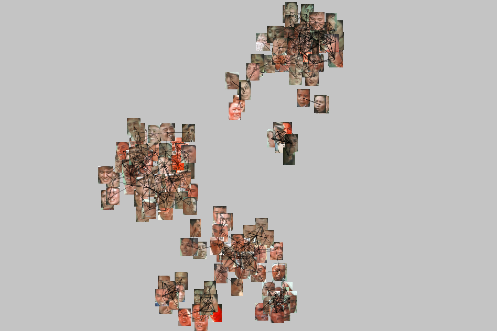
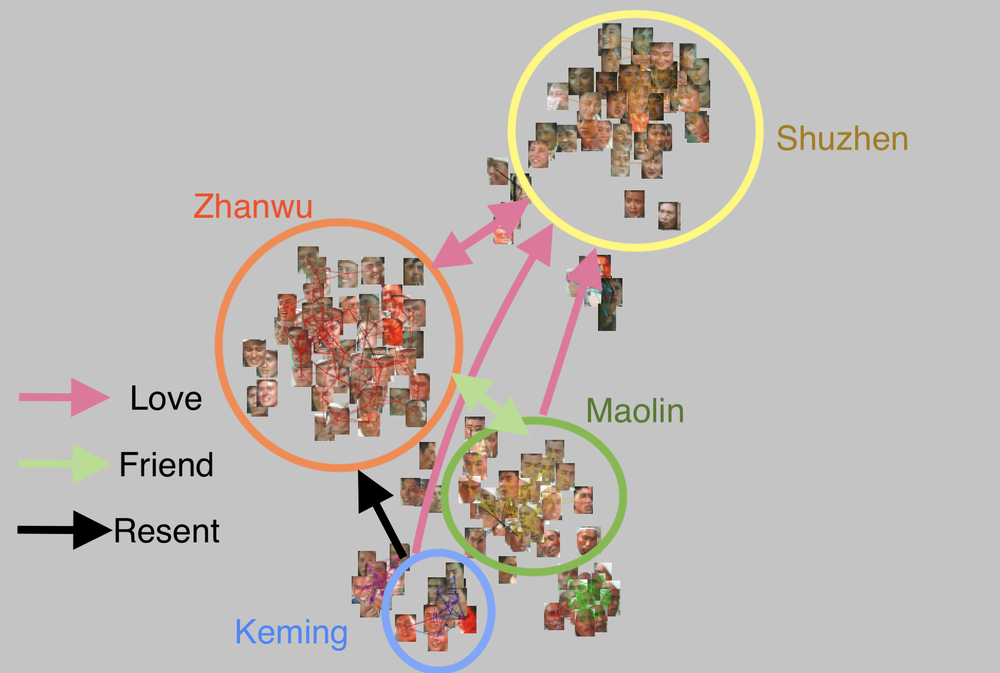
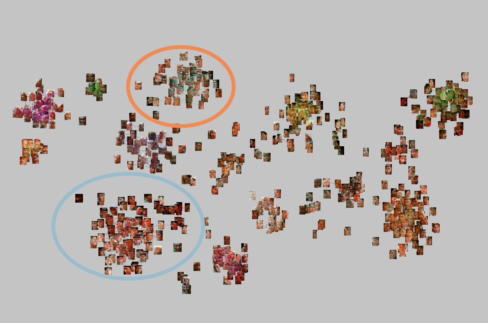
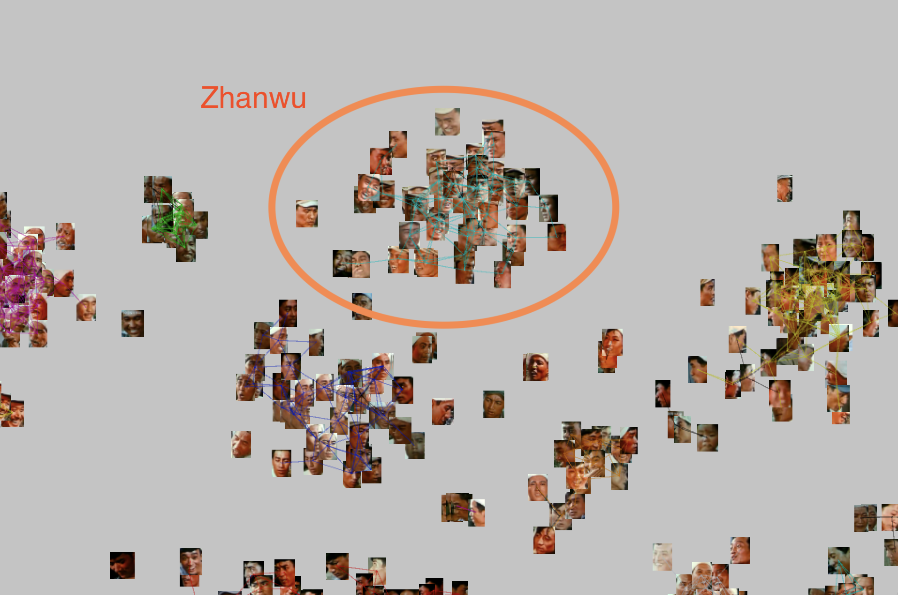
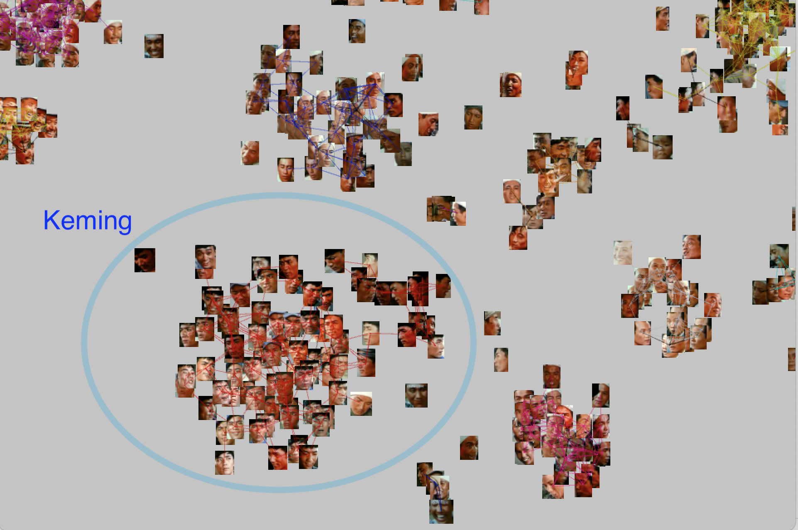
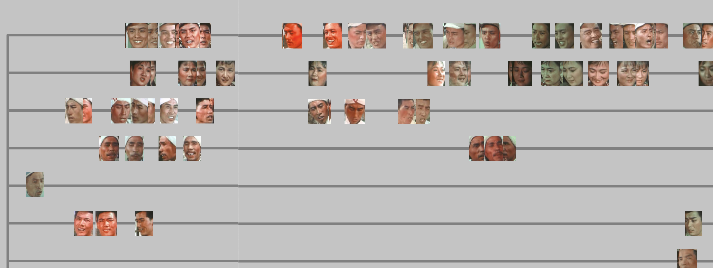

# SimpleFaceClustering
A very basic Face Clustering program based on DeepFace

## Usage

To use this program, please see the [Demo](demo.ipynb).
This program gives credit to the powerful library of [DeepFace](https://github.com/serengil/deepface).

It also comes with a JAVA-Processing-4-based [visualisation program](viz/viz.pde), which looks like this (in ideal conditions):

## Controls

Keys for controlling the visualisation program:

### Import
Changing the DIR variable in the PDE file to import the results from a processed video or image folder.
A tsne.csv generated by the Python program will be necessary for a project to be loaded.

### Export
Press key 'e' to export the results of clusters as a file named "clusters.tsv".

### Display
Use key 'r' to reset the camera.

The axis scaling factor can be controlled with keys 'a' and 'd'.

The local scaling of images can be controlled with keys 's' and 'w'.

The zooming of the camera can be controlled with the mouse wheel.

The camera can be moved by mouse dragging.

### Dragging
The dragging function allows the graph to editted in real time.

It does not affect the results of face recognition and dimension reduction,
but it will modify the results exported in CSV.

Key 'g' can be used to enter and exit dragging mode. A circle will be shown under the cursor when this mode is enabled. In dragging mode all the faces displayed can be dragged, and the results of clustering will be recalculated after the selected faces are dragged to their new positions.

Key 'u' and 'i' can be used to set the range that the mouse can drag at one time.

### Similarity Comparing
The threshold that determines the how close can two persons be considered of the same identity can be controlled with keys 'j' and 'k'.
Lines will be drawn between the faces that are believed to be of the same identity.

### Performance
Some variables in the PDE file can be used to improve the program's performance.

"disable_auto_reclustering" is used to disable/enable auto reclustering, and key 'y' is used to force the program to update clusters when auto reclustering is disabled. This is especially useful on graphs that contain more than 500 faces, as the distance between each face should be calculated in one frame when they are automatically updated.

"disable_tinting" decides whether tinting will applied on dragged images. It will improve the performance when too many images are being dragged together.

"useEuclidean512" is an experimental setting and has been deprecated on 21-May-2023 release. It replaces the default method that calculated distance with T-SNE 2-dimentional matrix with the original 512-dimentional matrix generated by Facenet512. It causes significant lagging and is incompitable with the dragging mode.

## Demonstration

This sections demonstrates how this program can be used to study film narrative structure with a Chinese film sequal, Young People in Our Village (1959-1963). In this case, the close-up shots from the two films in this sequal were used as the corpus.

The first entry of the sequal tells a love-cube story of three young men -- Zhanwu, Keming, and Maolin --
in love with a young woman named Shuzhen in their village. Through face clustering, we can easily identify such a love cube structure:

In the first entry, Keming is the rival of Zhanwu and depicted as an unfaithful playboy. In its subsequence, however, the story changed its focus to the friendship between the main characters and how Keming overcame his unfaithfulness. The clustering results also reflects on this change in narrative focus:

In addition, as Keming's importance increased in the story, he became the largest cluster in the subsequent film, which suggests that he has received close-up shots even more than the leading character Zhanwu:

# Timeline

This is an experimental feature added on 22/May/2023. It maps the appearance of clustered faces based on the frame code recorded in a processed video. Using this feature, the interactions between characters in a film can be explored:

